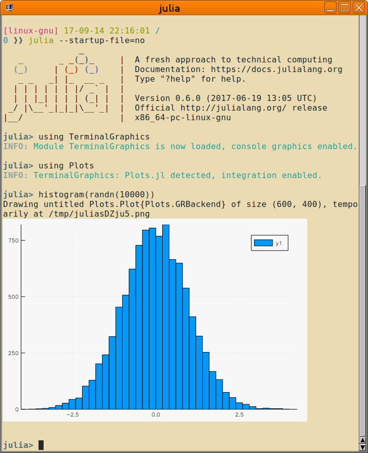

# TerminalGraphics – True graphics for your Julia REPL!

**A proof of concept!** — for which a picture says more than a thousand words...

Some terminal emulators support the DEC Sixel raster graphics format,
and ['libsixel'](https://github.com/saitoha/libsixel/) provides a convenient
and fast way to generate the required terminal escape sequences. So, why not
use this several decade old technology for modern technical programming tasks?

This library intends to provide support to print the most common types of
graphics in your Sixel-enabled terminal emulator - without user interaction.

Note that quite a number of libraries and Julia packages provide similar
support natively, if requested.  This includes 'ImageMagick', 'GR',
'Matplotlib', 'Gnuplot' etc.  However, 'TerminalGraphics' intends to relieve
you from the burdon to figure this out by yourself, and tries to provide
similar for other usecases - eventually.

## Installation and Usage

 1. Use the Julia package manager to obtain 'TerminalGraphics'

        Pkg.clone("https://github.com/m-j-w/TerminalGraphics.jl")
        Pkg.build("TerminalGraphics")

    This should, by all means, download and install a recent version of
    'libsixel', compile it and provide it for the Julia backend.
    If that doesn't work, then try to compile it and install it manually.
    The `Pkg.build` step should find it if in regular places.

 2. Use a Sixel-capable terminal emulator to host your Julia REPL. Note, that
    if you connect from remote, then the terminal emulator is the relevant
    piece of software regarding displaying graphics, not the remote host
    operating system.

## Terminal Emulators with Sixel Support

Sixel support is not too common in terminal emulators.  However, there are a few
which should allow to use TerminalGraphis from every operating system:

 - Windows: Use MinTTY, which supports Sixel out-of-the-box.  Also allows you to
   connect to a Julia session hosted in Bash-on-Windows, aka WSL.
 - Linux: Use MLTerm, which also supports Sixel graphics out-of-the-box.
   For xterm, rxvt etc. a rebuild from source and probably some patches are
   required.  More information is found at (https://github.com/saitoha/libsixel/).
 - Mac: Sorry, no idea...

[Hayaki Saito](https://github.com/saitoha) has also created quite a number of
patches for other terminal emulators, such as 'rxvt'.

## Julia Integration

TerminalGraphics implements a wrapper for 'libsixel', and an interface to the
Julia multimedia displaying machinery.  This way, images can be 'shown'
automatically in the terminal.  If necessary, the image data is converted to
8bit per color channel, and flipped to row-major.
Also note that there is automatic detection of `Plots`, `Cairo` and `Luxor`.
Thus even if loaded after 'TerminalGraphics', the proper functions will be
injected.  This is experimental and still somewhat error prone.

## Caveats and Limitations

Sixel can typically only draw 256 colors.  Thus, libsixel provides a number of
algorithms to dither the original image.  However, some images are not (yet)
shown correctly.

## Further directions

Some ideas for further development include automatic conversion of output
from 'Plots' and 'Luxor'.  For sure there are other neat or practical
opportunities.  Most notably, libsixel can also handle animated gifs...

**Your contributions in this effort are highly welcome!**
