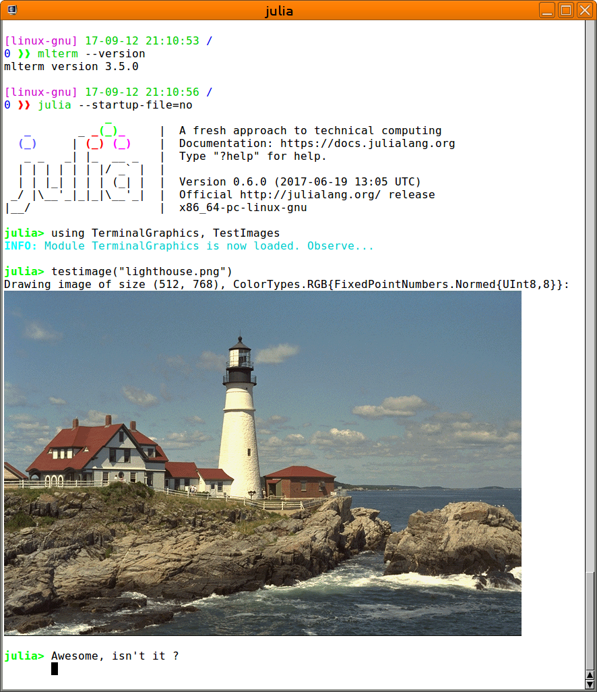

# TerminalGraphics – True graphics for your Julia REPL!

**A proof of concept!** — for which a picture says more than a thousand words...

Some terminal emulators support the DEC Sixel raster graphics format,
and ['libsixel'](https://github.com/saitoha/libsixel/) provides a convenient
and fast way to generate the required terminal escape sequences. So, why not
use this several decade old technology for modern technical programming tasks?

## Installation and Usage

 1. Use the Julia package manager to obtain 'TerminalGraphics'

        Pgk.clone("Pkg.clone("https://github.com/m-j-w/TerminalGraphics.jl")

 2. Download a recent version of ['libsixel'](https://github.com/saitoha/libsixel/)
    (master branch) and build it from source.

 3. Tell 'TerminalGraphics' where to find 'libsixel', by either

  a) setting the environment variable `JULIA_LIBSIXEL` to point to the exact
     path and filename of your compiled 'libsixel.so'; or
  b) create a symlink below the package directory of
     'TerminalGraphics/lib/libsixel.so'; or
  c) place your libsixel somewhere, where the operating system library loader
     would find it anyway.

 4. Use a Sixel-capable terminal emulator to host your Julia REPL. Note, that if
    you connect from remote, then the emulator is the relevant piece of
    software, not the remote host operating system.

## Terminal Emulators with Sixel Support

Sixel support is not too common in terminal emulators.  However, there are a few
which should allow to use TerminalGraphis from every operating system:

 - Windows: Use MinTTY, which supports Sixel out-of-the-box.  Also allows you to
   connect to a Julia session hosted in Bash-on-Windows, aka WSL.
 - Linux: Use MLTerm, which also supports Sixel graphics out-of-the-box.
   For xterm, rxvt etc. a rebuild from source and probably some patches are
   required.  More information is found at (https://github.com/saitoha/libsixel/).
 - Mac: Sorry, no idea...

## Julia Integration

TerminalGraphics implements a wrapper to libsixel, and an interface to the Julia
multimedia displaying machinery.  This way, images can be 'shown' automatically
in the terminal.  If necessary, the image data is converted to 8bit per color
channel, and flipped to row-major.

## Caveats and Limitations

Sixel can typically only draw 256 colors.  Thus, libsixel provides a number of
algorithms to dither the original image.  However, some images are not (yet)
shown correctly.

## Further directions

Some ideas for further development include automatic conversion of output
from 'Plots' and 'Luxor'.  For sure there are other neat or practical
opportunities.  Most notably, libsixel can also handle animated gifs...

Your contributions in this effort are highly welcome!

